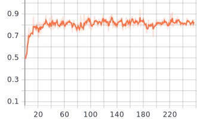

# Briscola Agent implementation with deep-q-learning 

## Approach
Standard Deep-q-learning was around 50% win rate until the last episode,
 basically like a random player. In order to converge to an acceptable result, 
 further tunings have been applied to the standard deep-q-learning training in two ways:
 - Alterations at the training algorithm in order to improve convergence and speed
 - Set up multiple tasks to the deep-q-nn in order to learn more general and useful features
     
### State Representation
 How to represent the current state 
 is an important choice to train neural network
 - Each card is represented by a vector of length 6 containing:
 1 is for card value [1-10], 1 is for card points [0-11] and 
 4 for one hot encoding representation of the seed
 - Missing card are represented by a vector of -1
 - The state is composed by a fixed length vector containing hand cards, 
 table card, briscola card, points of both players, current turn and win/lose between each hand card
 and table card
 - The state have other two variable-size vectors contains respectively thrown cards
 and non-thrown cards

### Variants of Deep-Q-Learning Algorithm

In order to stabilize deep q training the following modifies are applied
to the standard deep q learning training algorithm
- Epsilon = 1.0 (probability of random action) at the first episode, linear decrease at the increment of episode
- Adaptive epsilon increase based on agent match loses
- In Bellman equation appears also the rewards of the next two states
- The estimated Q values are divided in two parts:
 the state value and the advantages of each action.
 Both parts are estimated by the model then
 for convergence reasons advantages are scaled by their mean;
 then we sum state value with advantages to have q values  
 Paper Link: [Dueling Network Architecture for Deep Reinforcement Learning (Wang et al., 2015)](https://arxiv.org/abs/1511.06581)

### Multi Task
 Good feature learning is essential to train a neural network, so to accomplish that
 the model should be able to estimate different but correlated tasks
 like:
 - Predict of the enemy next card given in input the actual state
 - Predict of the next state given in input the actual state

### Neural Network Architecture

- Model optimizer is RAdam with default parameters
- Each FC is composed by Linear, Batch Norm and ReLU
- Model weights is saved at the path briscola/player/smart_player/brain.pth

### Opponent

At this time, the model is tested only against a random agent.
In the future i want to test also against Epsilon-greedy agent and against itself

#### Agent performance against random opponent

Down below we can see the win rate of the QAgent against random opponent every 100 matches.
We can clearly see that after 5000 matches the convergence is reached

